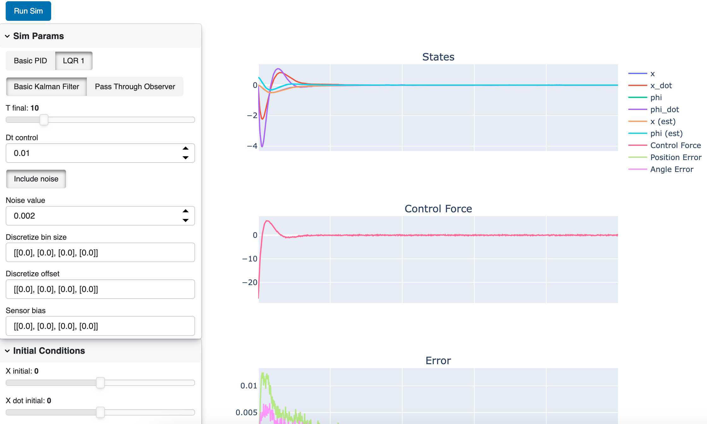

# Control Demo

https://github.com/jpaine126/Inverted_Pendulum_Control_Demo

This project implements an array of controller, observer, sensor, and noise models to demonstrate how they work and the different effects on performance for stabilizing an inverted pendulum. Everything is run through a dashboard that allows you to interactively run and re-run the simulation to observe the effects in

The model used for this project is taken from the "Controls Tutorials for Matlab and Simulink" course on inverted pendulums, found [here](http://ctms.engin.umich.edu/CTMS/index.php?example=InvertedPendulum&section=SystemModeling). All images shown are also taken from this site.

## Overview

This section will give a brief overview about the Inverted Pendulum Dynamic System.

### The Inverted Pendulum

The inverted pendulum is a classic example of an unstable dynamic system. The goal of this project is to simulate this system, and to design and implement a control scheme that balances the pendulum. More info on the dynamics can be found [here](http://ctms.engin.umich.edu/CTMS/index.php?example=InvertedPendulum&section=SystemModeling).

### Running the Simulation

Run the dashboard by running `python -m Inverted_Pendulum_Control_Demo` from the directory root. Selecting a different controller or observer in the top left-hand pane will change the parameters available. Click "Run Sim" to run with your selected parameters.

