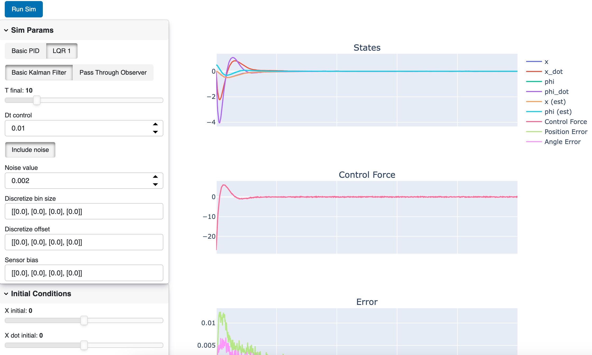

# Control Demo

https://github.com/jpaine126/Inverted_Pendulum_Control_Demo

This project implements an array of controller, observer, sensor, and noise models to demonstrate how they work and the different effects on performance for stabilizing an inverted pendulum. Everything is run through a dashboard that allows you to interactively run and re-run the simulation to observe the effects in

The model used for this project is taken from the "Controls Tutorials for Matlab and Simulink" course on inverted pendulums, found [here](http://ctms.engin.umich.edu/CTMS/index.php?example=InvertedPendulum&section=SystemModeling). All images shown are also taken from this site.

## Overview

This section will give a brief overview about the Inverted Pendulum Dynamic System.

### The Inverted Pendulum

The inverted pendulum is a classic example of an unstable dynamic system. The goal of this project is to simulate this system, and to design and implement a control scheme that balances the pendulum. More info on the dynamics can be found [here](http://ctms.engin.umich.edu/CTMS/index.php?example=InvertedPendulum&section=SystemModeling).

### Running the Simulation

Run the dashboard by running `python -m Inverted_Pendulum_Control_Demo` from the directory root. Selecting a different controller or observer in the top left-hand pane will change the parameters available. Click "Run Sim" to run with your selected parameters.

## Controllers

- **Basic PID** — PID on pendulum angle only. Cart position is ignored, so the cart will drift.
- **LQR 1** — Full-state LQR built from the linearized plant. `lqr_q` (4x4 state weights) and `lqr_r` (1x1 input weight) are editable tables. Defaults penalize `x` and `phi`.

## Observers

- **Pass Through Observer** — Perfect observer that returns the exact state with noise.
- **Dynamic Kalman Filter** — 4D KF on `[x, x_dot, phi, phi_dot]`, predicting with the discretized linear plant. Tunable `Q` (4x4 process noise) and `R` (2x2 measurement noise). Only `x` and `phi` are measured, with velocities reconstructed from the model.
- **CA Kalman Filter** — Constant-acceleration kinematic KF on a 6D internal state `[x, x_dot, x_ddot, phi, phi_dot, phi_ddot]`, using the Bar-Shalom white-noise-jerk process noise. The plant's 4 states come out of indices `[0, 1, 3, 4]`. `Q` is a single jerk spectral density shared by both axes. Due to the kinematic definition that doesn't properly capture dynamic coupling between the states, this filter will always end up diverging.

## Sim Inputs

The measurement chain runs in this order each control step: uniform noise on all four states, then per-state quantization, then per-state bias.

- **Noise**: `include_noise`, `noise_value` (uniform, half-width).
- **Sensor**: `discretize_bin_size` (0 turns quantization off for that state), `discretize_offset`, `sensor_bias` — each a 4x1 array.
- **Disturbance**: Process force on the cart, not fed forward to the controller or observer so the filter has to estimate through it. `include_disturbance`, `disturbance_type` (`sinusoidal` or `white_noise`), `disturbance_amplitude` (peak N for sinusoidal, std-dev N for white noise), `disturbance_frequency` (Hz, sinusoidal only).
